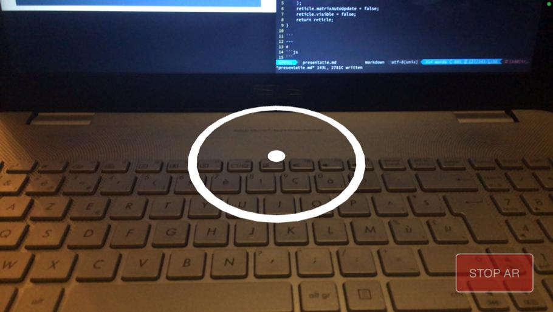
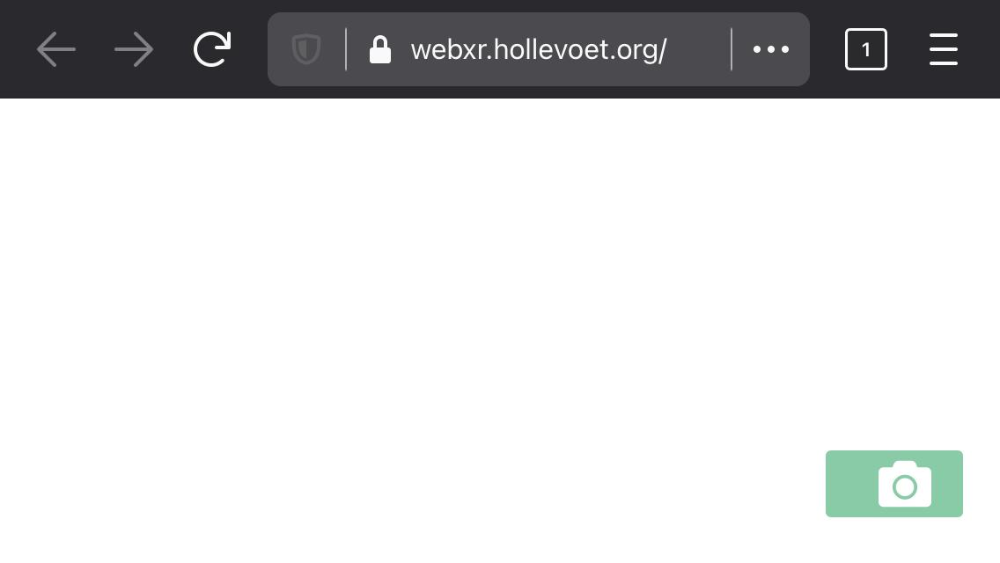
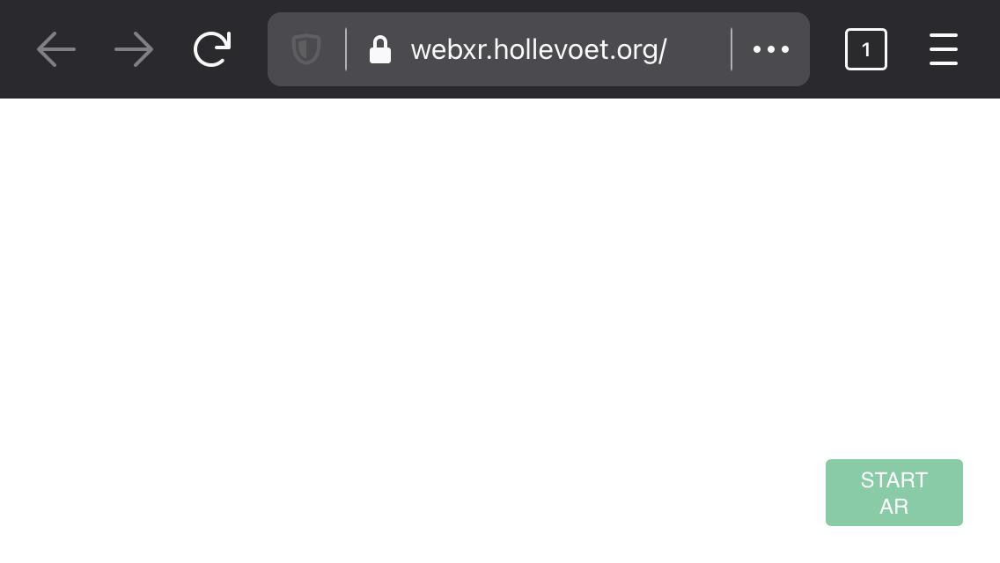
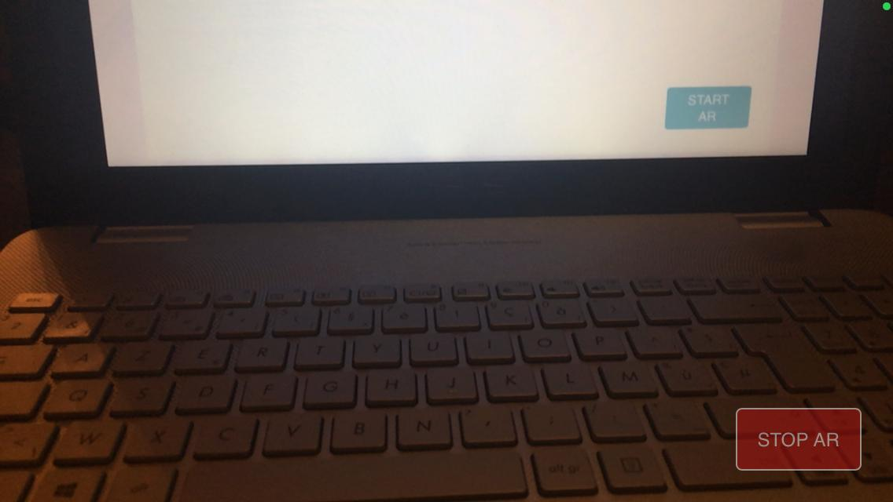

<!-- $theme: gaia -->
<!-- $size: 16:9 -->
<!-- *template: gaia -->

<link rel="stylesheet" href="./css/presentation.css" />

# Learning Group WebXR
### Intro to WebAR with ThreeJS

Creating a tape measure webapp

Thomas Hollevoet
wednesday 6 january 2021

---
# index.html

```html
<script type="module">
	import { App } from './app.js';

	document.addEventListener("DOMContentLoaded", function(){
		const app = new App();
		window.app = app;
	});
</script>
``` 
---
# app.js

```js
class App{
	constructor(){
		// Setup ThreejS	
	}

	method() {
		// Method of App
	}
}

export { App };
``` 
---
# Libraries

```js
import * as THREE from './libs/three/three.module.js';
import { BufferGeometryUtils } from './libs/three/jsm/BufferGeometryUtils.js';
import { ARButton } from './libs/ARButton.js';

class App {...}

export { App };
```
---
# Basic ThreeJS Setup
```js
constructor(){
	this.camera = new THREE.PerspectiveCamera( 70, window.innerWidth / window.innerHeight, 0.01, 20 );
	this.camera.position.set( 0, 1.6, 3 );
  
	this.scene = new THREE.Scene();

	const ambient = new THREE.HemisphereLight(0xffffff, 0xbbbbff, 2);
	ambient.position.set( 0.5, 1, 0.25 );
	this.scene.add(ambient);
  
	const light = new THREE.DirectionalLight();
	light.position.set( 0.2, 1, 1);
	this.scene.add(light);
}
```
---
# Renderer
```js
constructor(){
	...

	const container = document.createElement( 'div' );
	document.body.appendChild( container );
  
	this.renderer = new THREE.WebGLRenderer({ antialias: true, alpha: true } );
	this.renderer.setPixelRatio( window.devicePixelRatio );
	this.renderer.setSize( window.innerWidth, window.innerHeight );
	this.renderer.outputEncoding = THREE.sRGBEncoding;
	container.appendChild( this.renderer.domElement );
}
```
---
# App setup
```js
constructor(){
	...

	this.workingVec3 = new THREE.Vector3();
	this.labels = [];
	this.measurements = [];
  
	this.initScene();
	this.setupXR();
  
	this.renderer.setAnimationLoop( this.render.bind(this) );
  
	window.addEventListener('resize', this.resize.bind(this));
}
```
---
# On Resize
```js
resize(){ 
	this.camera.aspect = window.innerWidth / window.innerHeight;
	this.camera.updateProjectionMatrix();
	this.renderer.setSize( window.innerWidth, window.innerHeight );  
}	
```
---
# Reticle
```js
initScene(){
	this.reticle = this.initReticle();
	this.scene.add( this.reticle );
}

initReticle() {
	let ring = new THREE.RingBufferGeometry(0.045, 0.05, 32).rotateX(- Math.PI / 2);
	let dot = new THREE.CircleBufferGeometry(0.005, 32).rotateX(- Math.PI / 2);
	const reticle = new THREE.Mesh(
		BufferGeometryUtils.mergeBufferGeometries([ring, dot]),
		new THREE.MeshBasicMaterial()
	);
	reticle.matrixAutoUpdate = false;
	reticle.visible = false;
	return reticle;
}
```
---



---
# Setup XR
```js
setupXR(){
	this.renderer.xr.enabled = true;
  
	const btn = new ARButton( this.renderer,
		{ sessionInit: {
			requiredFeatures: [ 'hit-test' ],
			optionalFeatures: [ 'dom-overlay' ],
			domOverlay: { root: document.body }
		}});
```
---



---



---



---
#  Setup XR
```js
setupXR(){
	...

	const self = this;
	this.hitTestSourceRequested = false;
	this.hitTestSource = null;
  
	function onSelect() {...}

	this.controller = this.renderer.xr.getController( 0 );
	this.controller.addEventListener( 'select', onSelect );
  
	this.scene.add( this.controller );    
}
```
---
# On Select
```js
function onSelect() {
	if (self.reticle.visible){
		const pt = new THREE.Vector3();
		pt.setFromMatrixPosition(self.reticle.matrix);
		self.measurements.push(pt);

		if (self.measurements.length == 2) {
			...
		} else {
		  self.currentLine = self.initLine(self.measurements[0]);
		  self.scene.add(self.currentLine);
		}
	}
}
```
---
# Init Line
```js
initLine(point) {
	const lineMaterial = new THREE.LineBasicMaterial({
		color: 0xffffff,
		linewidth: 5,
		linecap: 'round'
	});

	const lineGeometry = new THREE.BufferGeometry().setFromPoints([point, point]);
	return new THREE.Line(lineGeometry, lineMaterial);
}
```
---
# Render
```js
render( timestamp, frame ) {
	const self = this;
  
	if ( frame ) {
		if ( this.hitTestSourceRequested === false ) this.requestHitTestSource( )
		if ( this.hitTestSource ) this.getHitTestResults( frame );
	}
  
	this.labels.forEach( label => {
		const pos = self.toScreenPosition(label.point, self.renderer.xr.getCamera(self.camera));
		label.div.style.transform = `translate(-50%, -50%) translate(${pos.x}px,${pos.y}px)`;
	})

	this.renderer.render( this.scene, this.camera );
}
```
---
# RequestHitTestSource
```js
requestHitTestSource(){
	const self = this;
	const session = this.renderer.xr.getSession();

	session.requestReferenceSpace( 'viewer' ).then(referenceSpace => {
		session.requestHitTestSource( { space: referenceSpace } ).then(source => {
			self.hitTestSource = source;
		});
	});

	session.addEventListener( 'end', () => {
		self.hitTestSourceRequested = false;
		self.hitTestSource = null;
		self.referenceSpace = null;
	});

	this.hitTestSourceRequested = true;
}
```
---
# GetHitTestResults
```js
getHitTestResults( frame ){
	const hitTestResults = frame.getHitTestResults( this.hitTestSource );

	if ( hitTestResults.length ) {
		const referenceSpace = this.renderer.xr.getReferenceSpace();
		let hit = hitTestResults[ 0 ];
		let pose = hit.getPose( referenceSpace );

		this.reticle.visible = true;
		this.reticle.matrix.fromArray( pose.transform.matrix );
  	
		if (this.currentLine) this.updateLine(this.reticle.matrix, this.currentLine);
	} else {
		this.reticle.visible = false;
	}
}            
```
---
# UpdateLine
```js
updateLine(matrix, line) {
	let positions = line.geometry.attributes.position.array;
	positions[3] = matrix.elements[12]
	positions[4] = matrix.elements[13]
	positions[5] = matrix.elements[14]
	line.geometry.attributes.position.needsUpdate = true;
	line.geometry.computeBoundingSphere();
}
```
---
# ToScreenPosition
```js
toScreenPosition(point, camera){
	let width = window.innerWidth;
	let height = window.innerHeight;
	let vec = this.workingVec3;
  
	vec.copy(point);
	vec.project(camera);

	vec.x = (vec.x + 1) * width /2;
	vec.y = (-vec.y + 1) * height/2;
	vec.z = 0;

	return vec
}
```
---
# On Select
```js
function onSelect() {
	...
		if (self.measurements.length == 2) {
		  let distance = Math.round(self.getDistance(self.measurements) * 100);

		  let text = document.createElement('div');
		  text.className = 'label';
		  text.style.color = 'rgb(255,255,255)';
		  text.textContent = distance + ' cm';
		  document.querySelector('#container').appendChild(text);

		  self.labels.push({div: text, point: self.getCenterPoint(self.measurements)});

		  self.measurements = [];
		  self.currentLine = null;
		} else {
		...
}
```
---
# GetDistance
```js
getDistance(points) {
	if (points.length == 2) return points[0].distanceTo(points[1]);
}
```
---
# GetCenterPoint
```js
getCenterPoint(points) {
	let line = new THREE.Line3(...points)
	return line.getCenter( new THREE.Vector3() );
}
```
---
#
---
# Live version
## https://webxr.hollevoet.org/tapemeasure

# Presentation
## https://webxr.hollevoet.org/tapemeasure/presentation.html
